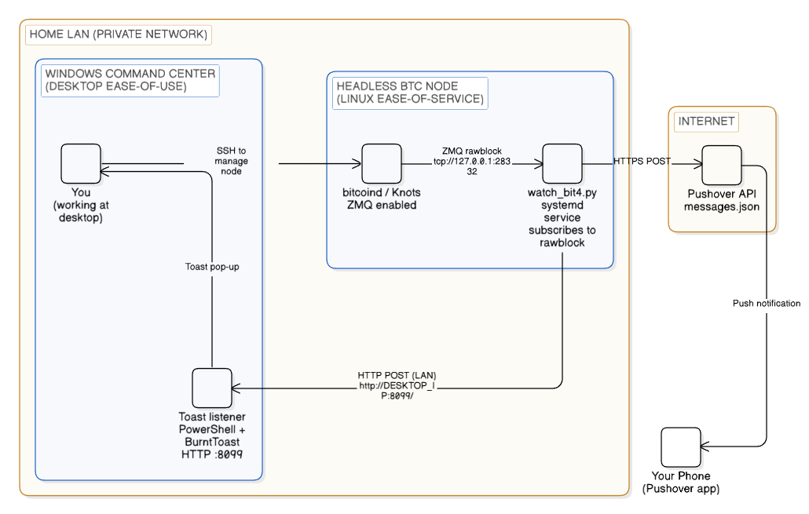

# BIP110 Bit-4 Watcher (v0.1)

This repo contains a **lightweight, opinionated watcher system** implemented across two machines:

1) **A Linux Bitcoin node** : runs `watch_bit4.py` and subscribes to your node’s ZMQ `rawblock` feed.  
2) **A Windows Desktop** : runs a simple HTTP listener that turns incoming messages into **BurntToast** notifications.

Optionally, the watcher can also send higher-attention alerts to your phone via **Pushover**.

The watcher as implemented checks for the BIP-110 “Reduced Data” support signal on **versionbits bit 4**. Miners can signal readiness and support by setting bit 4 in the `version` field of blocks they mine. The watcher alerts you when it sees a block with that bit set so it can be celebrated.

> This is a hobby / reference implementation. It’s designed to be forked and tailored to *your* environment.

---

## What this does

On each new block, `watch_bit4.py`:

- Receives raw blocks via ZMQ (`zmqpubrawblock`)
- Extracts the block hash, queries the header via `bitcoin-cli getblockheader`
- Checks whether **bit 4** is set in the header `version`
- Sends notifications based on your `.env` configuration

Notification channels supported:

- **Windows desktop toasts** via a LAN HTTP POST to `toast-listener.ps1` (BurntToast)
- **Phone notifications** via **Pushover** (optional)

---

## Configurations

The scripts are configurable to different tastes:

- I like **desktop toast on every block** (they don't bother me when I see them).
- But I reserve **phone notifications** for:
  - startup checks (to prove connectivity), and
  - only a **positive bit-4 signal**, and
  - a very low-rate **heartbeat** (e.g., every 144 blocks ≈ daily) so that phone = catch, toast = hunting.

Each channel can be configured to send:

- Startup test notice (`STARTUP_TOAST`, `STARTUP_PUSHOVER`)
- Heartbeats (`HEARTBEAT_TO_DESKTOP`, `HEARTBEAT_TO_PUSHOVER`)
- Heartbeat frequency in blocks (`HEARTBEAT_EVERY_N_BLOCKS`)
- Toast for every block regardless of result (`TOAST_EVERY_BLOCK`)

See `.env.example` for a working baseline.

---

## My Opinionated Setup For Reference 

My own personal setup looks like this:

- **A Separate Node:** A Linux headless box running bitcoind/knots with `zmqpubrawblock` 
- **A Separate Desktop:** A Windows machine on the same LAN running a BurntToast listener (HTTP POST)
- **A Phone:** iPhone running Pushover app (optional, for “real” alerts)

## Diagram View



## Files Included 

- `watch_bit4.py` — the watcher, installed on your node server (if Linux)
- `toast-listener.ps1` — Windows toast listener (BurntToast), installed on your personal computer (if Windows)
- `systemd/bip110-watch.service` — example systemd unit to run the watcher as a service on your node
- `.env.example` — sample configuration (copy to `.env` on your node)
- `requirements.txt` — Python library dependencies (pyzmq)

## Node prerequisites

In your `bitcoin.conf` you must expose zmqpubrawblock.  If you are not already doing so, an example config is:

```
zmqpubrawblock=tcp://127.0.0.1:28332
```
Restart bitcoind after changing configuration.

## Set Up Windows toast listener 
Install BurntToast (PowerShell):
```
Install-Module BurntToast -Scope CurrentUser
```
Reserve URL + firewall (example for port 8099):
```
netsh http add urlacl url=http://+:8099/ user=$env:USERNAME
New-NetFirewallRule -DisplayName "BIP110 Toast Listener 8099" -Direction Inbound -Action Allow -Protocol TCP -LocalPort 8099
```
Run the Toast-Listener:
```
.\desktop\toast-listener.ps1
```

Local Test from Desktop (you should see a toast):
```
Invoke-WebRequest -Method POST -Uri "http://localhost:8099/" -Body "Desktop listener test ✅"
```
## Set up Pushover (optional but recommended)

This is the “phone alert” channel.

1. Install the Pushover app on your phone (iOS App Store / Google Play).

2. Create a Pushover account and grab:
    - your User Key

3. Create an “Application” in Pushover to get:
    - an API Token/Key

Paste these into your node .env as:
- PUSHOVER_USER=...
- PUSHOVER_TOKEN=...

## Set up the watcher on the Node (Linux) 
The following assumes:

- your watcher lives at: /home/bitcoin/monitoring/bip110
- you have a bitcoin user (adjust paths if not)

1. Create project folder 
```
sudo -iu bitcoin mkdir -p /home/bitcoin/monitoring/bip110
sudo -iu bitcoin cd /home/bitcoin/monitoring/bip110
```
2. Create virtualenv and install dependencies
```
sudo -iu bitcoin bash -lc '
cd /home/bitcoin/monitoring/bip110 &&
python3 -m venv .venv &&
./.venv/bin/pip install -r requirements.txt
'
```
3. Create your .env
```
sudo -iu bitcoin bash -lc '
cd /home/bitcoin/monitoring/bip110 &&
cp .env.example .env
'
```
Edit your .env for run configuration:
- Set your desktop IP in DESKTOP_TOAST_URL (example: http://192.168.1.89:8099/)
- If using Pushover, set PUSHOVER_USER and PUSHOVER_TOKEN
- Decide whether you want:
    - every-block toasts (TOAST_EVERY_BLOCK=1)
    - heartbeats (HEARTBEAT_EVERY_N_BLOCKS=144, etc.)

## Run an interactive test from Node
Run the watcher manually once to prove it all works before committing to systemd:
```
sudo -iu bitcoin bash -lc '
cd /home/bitcoin/monitoring/bip110 &&
./.venv/bin/python ./watch_bit4.py
'
```
success is seeing log lines such as:
- 'Watching ZMQ rawblock...'
- 'Desktop toast enabled...'
- 'Pushover enabled...'
- One new log line per new BTC block

## Run an interactive LAN test (node to desktop)
```
curl --connect-timeout 3 --max-time 5 -H "Content-Type: text/plain; charset=utf-8" \
  --data-binary "LAN TEST from node ✅" \
  "http://DESKTOP_IP:8099/"
```

## Setup as Systemd managed background service
Copy unit file into place...
```
sudo cp systemd/bip110-watch.service /etc/systemd/system/bip110-watch.service
```
Enable & Start:
```
sudo systemctl daemon-reload
sudo systemctl enable bip110-watch.service
sudo systemctl start bip110-watch.service
```
Optional Follow Logs:
```
sudo journalctl -u bip110-watch.service -f
```
## License
MIT (see LICENSE).
